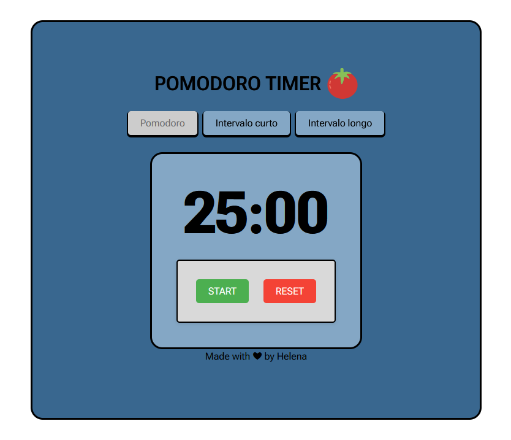

# Pomodoro Timer

> O Pomodoro Timer utiliza da técnica Pomodoro. A técnica consiste na utilização de um cronômetro para dividir o trabalho/estudo em períodos de 25 minutos. O projeto consta com, além dos 25 minutos disponíveis para estudo, também conta com intervalos curtos de 5 minutos e intervalos longos de 60 minutos.

### O projeto

O projeto já esta finalizado e as atualizações foram voltadas nas seguintes tarefas:

- [x] Utilize apenas HTML, CSS e JavaScript.
- [x] O cronômetro deverá possuir 3 botões: Botão "Pomodoro" para contagem de 25 minutos. Botão "Intervalo Curto" para contagem de 05 minutos. Botão "Intervalo Longo" para contagem de 60 minutos.
- [x] Exiba a contagem do cronômetro (que deverá ser regressiva). O campo deve ter como valor padrão 25:00 e alterar conforme o tipo de contagem selecionada. Ele deverá partir do valor inicial e chegar até 00:00.
- [x] Exiba o Botão "Start" para iniciar a contagem. Ao clicar no botão, a contagem do cronômetro deve acontecer de acordo com o tipo de contagem selecionada (pomodoro, intervalo curto ou intervalo longo).
- [x] Exiba o Botão "Reset" para restartar a contagem de acordo com o tipo de contagem selecionada (pomodoro, intervalo curto ou intervalo longo)

## 🚀 Acesse a live demo do projeto

https://relogiopomedoro.vercel.app/

## 🤝 Criadora

<table>
  <tr>
    <td align="center">
      <a href="https://github.com/len4cf" title="Helena Carvalho">
         
        
          <b>Helena Carvalho</b>
        
      </a>
    </td>
  </tr>
</table>

## 😄 Me envie um email!

<a href="mailto:helenacarvalhoferreira@gmail.com">helenacarvalhoferreira05@gmail.com</a>
